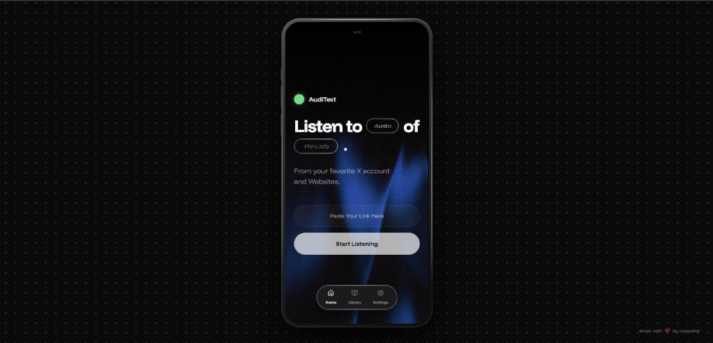
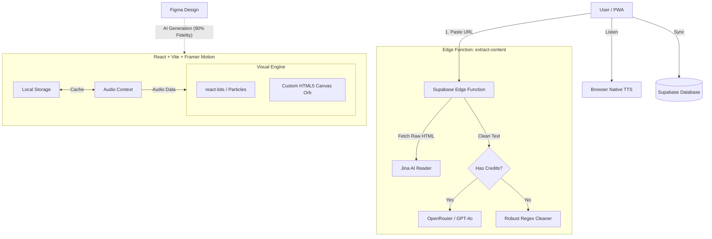
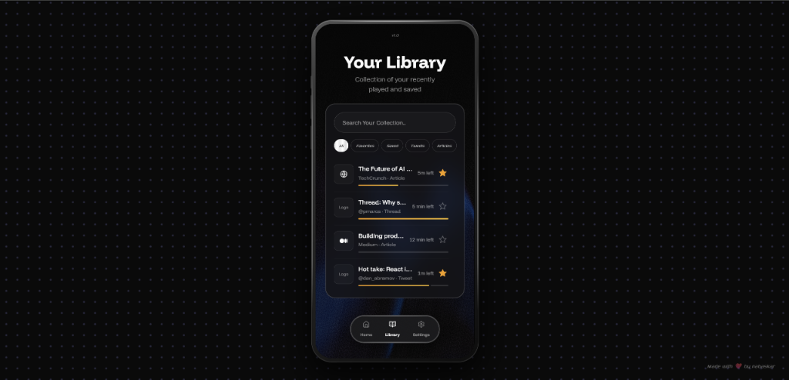

<p align="center">
  
</p>

<h1 align="center">🧠 AudiText AI</h1>

<p align="center">
  <strong>The Intelligent Audio Engine for the Semantic Web</strong>
</p>

<p align="center">
  AudiText is a next-generation <strong>AI-Powered Audio Reader</strong> that transforms the static web into immersive, high-fidelity audio experiences. By leveraging advanced Natural Language Processing (NLP) and state-of-the-art Text-to-Speech (TTS), it doesn't just read text—it understands context, declutters noise, and delivers a studio-quality listening experience.
</p>

<p align="center">
  <a href="#key-features">Key Features</a> •
  <a href="#ai-capabilities">AI Capabilities</a> •
  <a href="#tech-stack">Tech Stack</a> •
  <a href="#security-privacy">Security</a> •
  <a href="#quick-start">Quick Start</a>
</p>

<p align="center">
  
  
  
  
  
</p>

---

## 🚀 Why AudiText?

In an era of information overload, **AudiText** serves as your intelligent filter. Unlike standard screen readers that blindly recite metadata and ads, AudiText uses a bespoke **Smart Polish Layer** to semantically analyze content structure. It identifies the core narrative, strips away "hashtag spam" and repetitive headers, and synthesizes the remaining essence into fluid, human-like speech.

Whether you're commuting with a long-form article or multitasking with a Twitter thread, AudiText ensures you consume knowledge, not noise.

---

## ✨ Key Features

### <a name="ai-capabilities"></a>🧠 Smart Content Processing
- **Semantic Text Extraction**: Automatically parses complex DOM structures from X (Twitter), Medium, Substack, and more.
- **AI-Driven Polish Layer**:
  - **Contextual Cleanup**: Eliminates "clickbait" hooks, hashtags, and repetitive boilerplate.
  - **Smart Intro Generation**: Synthesizes professional intros ("Title, by Author") even when metadata is sparse.
  - **Deduplication Engine**: Detects and suppresses redundant information for seamless flow.

### 🎧 Immersive Playback Engine
- **Native Neural TTS**: Leverages the browser's built-in **Web Speech API** for unlimited, offline-capable speech synthesis without API quotas.
- **WebGL Audio Visualizer**: A real-time, reactively animated "Orb" that pulses with voice amplitude (built with Three.js & OGL).
- **Dynamic Speed Control**: Variable playback rates (0.5x - 2.5x) with pitch correction.

### 🛡️ Enterprise-Grade Security
- **Row Level Security (RLS)**: Database policies strictly enforce data sovereignty—users can *only* access their own library items.
- **Input Hardening**: Advanced sanitization prevents SQL/Command injection and XSS attacks via URL inputs.
- **Auth Integrity**: Robust localized authentication handling via Supabase Auth.

### 📱 Premium UX/UI
- **"Reactive Noir" Aesthetic**: A cohesive design language featuring glassmorphism, adaptive film grain (noise), and procedural gradients.
- **Mobile-First Progressive Web App (PWA)**: Touch-optimized scrub bars, haptic feedback integration, and 60fps animations on mobile devices.

---

## 🏗️ Cloud & AI Architecture

<p align="center">
The system uses a <strong>Dual-Layer Extraction Pipeline</strong> to ensure reliability even when AI credits are exhausted.
</p>



## 🎨 The "Vibe Coding" Workflow

AudiText is a case study in **AI-Native Development**. The goal was to bridge the gap between high-fidelity design and functional code in record time.

1.  **Vision First (Figma)**: The entire "Glassmorphism" aesthetic, including the film grain overlays and glowing accents, was designed in Figma first.
2.  **90% Fidelity Generation**: Figma screenshots were fed directly to AI agents, which generated the React components with pixel-perfect accuracy on the first pass.
3.  **Modern Enhancements**:
    *   **`react-bits`**: Used for the subtle particle background effects.
    *   **Custom Orb**: A hand-tuned HTML5 Canvas visualization (Simplex Noise) that reacts to the browser's audio frequency data.

---

## 🛠️ Tech Stack

### Frontend Core
| Technology | Role |
|------------|------|
| **React 19** | UI Library (using Server Components architecture where applicable) |
| **TypeScript** | Strict static typing for robustness |
| **Vite** | Next-gen frontend tooling and bundling |

### Visuals & Animation
| Technology | Role |
|------------|------|
| **Three.js / React-Three-Fiber** | 3D visualizers and WebGL effects |
| **GSAP (GreenSock)** | Commercial-grade UI animations and transitions |
| **Lucide React** | Consistent, lightweight iconography |

### Backend & Data
| Technology | Role |
|------------|------|
| **Supabase (PostgreSQL)** | Relational database with real-time subscriptions |
| **Supabase Auth** | User management and secure session handling |
| **Row Level Security (RLS)** | Database-level access control policies |

---

## 📸 Experience

<p align="center">
  
  
  
</p>

---

## <a name="quick-start"></a>⚡ Quick Start

### Prerequisites
- Node.js 18+
- npm or yarn

### Installation

1.  **Clone the Repository**
    ```bash
    git clone https://github.com/yourusername/AudiText.git
    cd AudiText
    ```

2.  **Environment Setup**
    Create a `.env` file in the root directory:
    ```bash
    cp .env.example .env
    ```
    Populate it with your credentials:
    ```env
    VITE_SUPABASE_URL=your_supabase_url
    VITE_SUPABASE_ANON_KEY=your_supabase_anon_key
    ```

3.  **Install Dependencies**
    ```bash
    npm install
    ```

4.  **Launch Development Server**
    ```bash
    npm run dev
    ```

---

## 🤝 Contributing

We welcome contributions from the community! Whether it's enhancing the AI parsing logic or adding new WebGL visualizers.

1.  Fork the repository.
2.  Create a feature branch (`git checkout -b feature/NeuralPolish`).
3.  Commit your changes with clear messages (`git commit -m 'feat: Enhance deduplication algorithm'`).
4.  Push to the branch (`git push origin feature/NeuralPolish`).
5.  Open a Pull Request.

---

### Edge Function Secrets (Optional / Advanced)
The core AudiText experience (Content Extraction + Native Browser TTS) requires minimal setup. However, the backend infrastructure supports advanced capabilities if you wish to enable them.

| Variable Name | Service | Status | Purpose |
|---------------|---------|--------|---------|
| `JINA_API_KEY` | **Jina.ai** | **Required** | Essential for converting raw URLs into clean Markdown. |
| `OPENROUTER_API_KEY` | **OpenRouter** | *Recommended* | Greatly improves article cleaning and formatting via LLMs. |
| `ELEVENLABS_API_KEY` | **ElevenLabs** | *Supported* | Enables server-side Neural TTS generation (if you extend the frontend to use it). |
| `GEMINI_API_KEY` | **Google Gemini** | *Supported* | Alternate fallback for AI cleaning. |

---

## 📄 License

Distributed under the MIT License. See `LICENSE` for more information.

---

<p align="center">
  <strong>Built with 🧠 + ❤️ by Nabaskar</strong>
</p>
