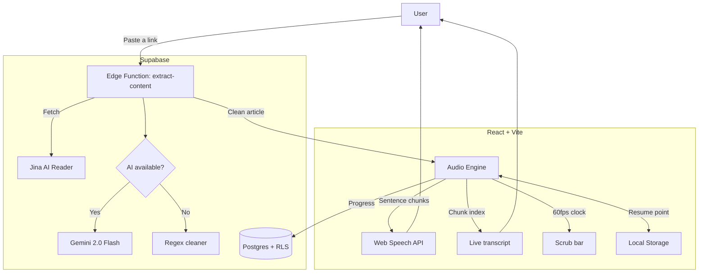

<p align="center">
  
</p>

<h1 align="center">AudiText</h1>

<p align="center">
  <strong>The web. Out loud.</strong>
</p>

<p align="center">
  Paste a link. Press play.<br>
  That's the whole thing.
</p>

<p align="center">
  <a href="#listen">Listen</a> •
  <a href="#read-along">Read Along</a> •
  <a href="#performance">Performance</a> •
  <a href="#privacy">Privacy</a> •
  <a href="#specs">Specs</a> •
  <a href="#quick-start">Get Started</a>
</p>

<p align="center">
  
  
  
  
  
</p>

---

## <a name="listen"></a>Sound, where there was only text.

There's a long article you've been meaning to read. A thread you saved. A post
you'll get to later.

You won't. Not with your eyes.

AudiText takes any link and turns it into something you can listen to — on the
walk, on the train, with your hands full and your screen dark. No app store.
No account required to start. Just a link and a play button.

---

## It reads the story. Not the sidebar.

Most readers recite whatever's on the page. Navigation. Cookie banners. *Share
this article.* Twelve hashtags in a row.

AudiText doesn't.

Every link runs through a two-stage pipeline. **Jina AI Reader** turns the raw
page into clean Markdown. **Gemini 2.0** then strips it down to the actual
narrative — no boilerplate, no clickbait hooks, no login prompts masquerading as
content. And if the AI layer is unavailable, a hardened regex pass takes over.
It never fails to a blank page.

Then the text is broken into sentence-sized pieces. Small enough to seek. Short
enough that no browser ever chokes on them.

---

## <a name="read-along"></a>Follow along. Line by line.

The words scroll with the voice.

The line being spoken sits bright and forward. The lines behind it fade back.
The whole transcript drifts upward on its own, keeping your place a third of the
way down the screen — close enough to read ahead, far enough not to rush you.

Look up mid-sentence and you'll find your place instantly. Or don't look at all.

---

## Scrub anywhere. It lands.

Drag the bar and playback follows. Not eventually — exactly.

Because the article is already divided into sentences, seeking is instant: the
engine jumps to the sentence under your thumb and starts speaking. Skip fifteen
seconds back to catch a name. Jump to the end. It always picks up mid-thought,
never mid-word.

And the progress bar tells the truth. It advances at sixty frames a second, but
never runs ahead of the voice actually speaking.

---

## Your speed. Your voice. Remembered.

Half speed to a quarter past double, in increments of five percent. Tap the
player to cycle the presets, or dial it in exactly from Settings.

Set it once. Every article after that starts the way you like it.

---

## Close the tab. Come back tomorrow.

AudiText remembers the article you were on and the sentence you stopped at.

Sign in and your library follows you — every piece you've saved, how far you
got, what you starred — on every device. Or stay a guest for a week and decide
later.

---

## <a name="performance"></a>Fast. Then faster.

Speed isn't a feature you add at the end. It's decided by what you refuse to do
sixty times a second.

- **176 KB gzipped** on first load. The desktop-only visual layer — another
  29 KB — never reaches a phone.
- **One render per event, not per frame.** The playback clock ticks at 60fps
  through an isolated context, so a several-hundred-line transcript doesn't
  re-render because a timestamp moved.
- **Zero animation nodes in the transcript.** Highlighting uses GPU-composited
  opacity and scale. Nothing touches layout.
- **Nothing runs in the background.** Canvas effects pause when the tab is
  hidden and stop the moment they leave the screen.
- **Honest motion.** Turn on *Reduce Motion* and the decorative loops don't
  slow down. They stop.

---

## Grain, glass, and a black that's actually black.

A single film-grain layer over true black. Frosted panels. A dot field on
desktop that ripples where you click, built on a spatial grid so it stays smooth
no matter how many dots are on screen.

On a wide display, the whole app sits inside a machined phone — because that's
where it's meant to live.

---

## <a name="privacy"></a>Private by design.

Your library is yours. Row Level Security is enforced in the database itself, so
a user can only ever read or write their own rows — not because the client is
polite about it, but because Postgres won't allow anything else.

Provider keys live in Edge Function secrets and never touch the browser. The
server tells you what it extracted. It doesn't tell you what it's holding.

---

## <a name="specs"></a>Specs

**Frontend**

| | |
|---|---|
| **React 19** + **TypeScript 5.9** | Strict, hook-based UI |
| **Vite 7** | Build tooling, chunk splitting, lazy routes |
| **Framer Motion** | Physics-based transitions |
| **GSAP** | Elastic easing for the desktop dot field |
| **Canvas 2D** | Film grain and dot field, hand-tuned |
| **Lucide** | Iconography |

**Backend**

| | |
|---|---|
| **Supabase Postgres** | Library storage |
| **Supabase Auth** | Google OAuth + guest sessions |
| **Edge Functions** (Deno) | Content extraction |
| **Row Level Security** | Per-user access, enforced in the database |

**Intelligence**

| | |
|---|---|
| **Jina AI Reader** | URL → clean Markdown |
| **Google Gemini 2.0 Flash** | Narrative extraction and cleanup |
| **Web Speech API** | On-device synthesis. No quotas, no per-word billing |

---

## How it fits together


```mermaid
graph TD
    User[User] -->|Paste a link| Edge[Edge Function: extract-content]

    subgraph Backend [Supabase]
        Edge -->|Fetch| Jina[Jina AI Reader]
        Edge --> AI{AI available?}
        AI -->|Yes| Gemini[Gemini 2.0 Flash]
        AI -->|No| Fallback[Regex cleaner]
        DB[(Postgres + RLS)]
    end

    Edge -->|Clean article| Audio[Audio Engine]

    subgraph Frontend [React + Vite]
        Audio -->|Sentence chunks| TTS[Web Speech API]
        Audio -->|Chunk index| Transcript[Live transcript]
        Audio -->|60fps clock| Scrubber[Scrub bar]
        Audio <-->|Resume point| Local[Local Storage]
    end

    Audio -->|Progress| DB
    Transcript --> User
    TTS --> User
```

The audio engine is the heart of it. Every utterance carries a token, so a
cancelled sentence can never advance the queue behind your back. Playback truth
lives in refs; React state is the mirror. Position, speed, and chunk index stay
in lockstep whether you seek, skip, change speed, or close the tab.

---

## Experience

<p align="center">
  
  
  
</p>

---

## <a name="quick-start"></a>Get started

**Requirements** — Node.js 18 or later.

```bash
git clone https://github.com/nabrahma/AudiText.git
cd AudiText
cp .env.example .env
npm install
npm run dev
```

Fill in `.env` with your Supabase project:

```env
VITE_SUPABASE_URL=your_supabase_url
VITE_SUPABASE_ANON_KEY=your_supabase_anon_key
```

The app fails fast and tells you if either is missing.

### Edge Function secrets

Set these on the Supabase side, not in the browser.

| Variable | Service | Status | Purpose |
|---|---|---|---|
| `JINA_API_KEY` | Jina.ai | **Required** | Turns a URL into clean Markdown |
| `GEMINI_API_KEY` | Google Gemini | Recommended | Sharpens extraction and cleanup |

Without the Gemini key the app still works — extraction falls back to the regex
cleaner, and the article still plays.

---

## Contributing

Fork it, branch it, and open a pull request.

```bash
git checkout -b feature/voice-selection
git commit -m "feat: add voice selection"
git push origin feature/voice-selection
```

Run `npm run lint` and `npm run build` before you push. Both should be silent.

---

## License

MIT. See `LICENSE`.

---

<p align="center">
  <strong>Designed and built by Nabaskar.</strong>
</p>
